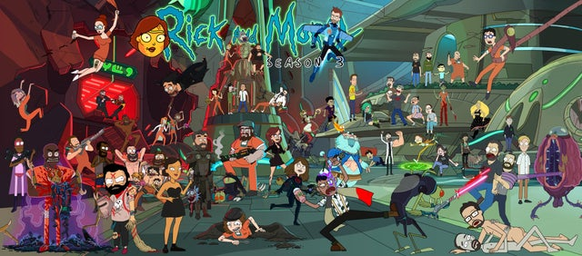

```{r setup, include=FALSE}
knitr::opts_chunk$set(echo = TRUE)
```




[Source](https://www.google.com/url?sa=i&url=https%3A%2F%2Fwww.reddit.com%2Fr%2Frickandmorty%2Fcomments%2F6zm99p%2Frick_and_morty_season_3_animation_crew_photo%2F&psig=AOvVaw0-mX3i8XYaLTTB6aowXfiH&ust=1652184861772000&source=images&cd=vfe&ved=0CAwQjRxqFwoTCKisjbey0vcCFQAAAAAdAAAAABAD)


## Introduction

The motivation behind this dataset comes from my fondness of the [Rick and Morty](https://www.adultswim.com/videos/rick-and-morty) show. It is a sci-fi cartoon show that primarily revolves around an old drunk cynical scientist (Rick) and his good-hearted grandson (Morty) who travel together across the multiverse for adventures. The show is a comic and delivers the viewvers with dark comedy and a plethora of emotions.

The main characters of the show are Rick, Morty, Summer (granddaughter), Jerry (Son-in-law), Beth (Daughter).

Although, I will be conducting sentiment analysis on these main characters primarily, however, I will be more focusing on my following hypothesis:

**Is Morty’s character driven by fear in the famous Rick and Morty show?**

Having seen the show multiple times, I have noticed that Morty's character is primarily driven by fear, however, I would like to test this hypothesis using some of the sentiment analysis tools. 

## Data

The data comes from [Kaggle](https://www.kaggle.com/datasets/andradaolteanu/rickmorty-scripts). It was initially scraped by Gabriel Harnandes and cleaned by Andrada Olteanu. 
 
I have uploaded the data to my [GitHub](https://github.com/Aftab1995/DS3) repo and sourced it from there for my analysis.
The dataset has following columns:

1. index: just the index of the row
2. season no: The season number of the dialogue
3. episode no: The episode number of the dialogue
4. episode name: The name of the episode
5. name: the character name
6. line: the dialogue of the character

```{r message=FALSE, warning=FALSE, include=TRUE}
# Loading the libraries
library(tidyverse)
library(tidytext)
library(kableExtra)
library(ggplot2)
library(stringr)
#install.packages("textclean")
library(textclean)
library(tm)
library(wordcloud)
library(wordcloud2)
library(RColorBrewer)
library(reshape2)
#install.packages("magick")
library(circlize)
library(magick)
library(gridExtra)
library(grid)
#install.packages("ggraph")
library(ggraph)
library(igraph)
```


```{r message=FALSE, warning=FALSE, include=TRUE}
# Loading the data from Github

data<-read.csv(url('https://raw.githubusercontent.com/Aftab1995/DS3/main/Dataset/RickAndMortyScripts.csv'),encoding="UTF-8")
```

## EDA

Checking to see if there are any missing data in the dataset using the following code. 
We can confirm that we don't have any missing values in our dataset so we can proceed with EDA.
```{r message=FALSE, warning=FALSE}
# Checking for any missing values
to_filter <- sapply(data, function(x) sum(is.na(x)))
to_filter[to_filter > 0]
```


To understand more about the data, I have grouped together the total number of lines spoken by each character in every season of the show and narrowed down the list to top 10. As expected, the highest number of lines are by Rick followed by Morty. As the name of the show suggests, these two are the main characters and their total number of lines far excceeds others'.
```{r message=FALSE, warning=FALSE}

# Looking at the top 10 number of lines by character in all the seasons together

data %>% 
  group_by(Character = name) %>% 
  summarise(Total.Lines = n()) %>% 
  arrange(desc(Total.Lines)) %>%
  head(10) %>% 
  kbl() %>%
  kable_styling(bootstrap_options = c("striped", "hover", "condensed", "responsive"))
  
```

I then wanted to look at the number of lines for each character by season. So I created three tables, one for each season to retrieve the top 10 characters along with their lines. I then fully joined these tables to not loose out information on characters that only appear in one of the seasons. Then, in order to visualize the results, I gathered the table so that I could use it for ggplot function.

Looking at the bar plot overall, it is synonymous to the table above in terms of total lines. However, when we look at it from season perspective, season 2 stand out. There seems to be a tie between the total number of lines by Rick and Beth, which is followed by a seemingly tie between the number lines by Morty and Jerry. 

We can also see from the plot that for some characters, they only appear in one season only, reason being that either they did not appear in the season at all or their number of lines was not enough to be in the top 10 for that particular season. 

For season 3, Pickle Rick is also in top 10, reason being that there was a whole episode dedicated to this character where Rick turns himself into a pickle to prove his might, one of my favorite episodes. He builds himself a full body armour by killing sewer rats and cockroaches while being a pickle.  


```{r message=FALSE, warning=FALSE}
# Looking at the top 10 characters by season 

# Season 1
s1_lines <- data %>% 
  filter(season.no. == 1) %>% 
  group_by(Character = name) %>% 
  summarise(Total.Lines.S1 = n()) %>% 
  arrange(desc(Total.Lines.S1)) %>%
  head(10) 

# Season 2
s2_lines <- data %>% 
  filter(season.no. == 2) %>% 
  group_by(Character = name) %>% 
  summarise(Total.Lines.S2 = n()) %>% 
  arrange(desc(Total.Lines.S2)) %>%
  head(10) 

# Season 3
s3_lines <- data %>% 
  filter(season.no. == 3) %>% 
  group_by(Character = name) %>% 
  summarise(Total.Lines.S3 = n()) %>% 
  arrange(desc(Total.Lines.S3)) %>%
  head(10) 

lines <- full_join(s1_lines,s2_lines,by="Character")
lines <- full_join(lines,s3_lines,by = "Character")


lines <- gather(lines, "season", "lines", 2:4)

lines <- arrange(lines, "lines")

ggplot(lines) +
  aes(x = reorder(Character, -lines), fill = season, weight = lines) +
  geom_bar() +
  labs(
    x = "Character Name",
    y = "Number of Lines",
    title = "Character Lines by Season"
  ) +  
  ggthemes::theme_economist() +
  theme(
    legend.position = "bottom",
    plot.title = element_text(size = 15L,
    face = "bold",
    hjust = 0.5
    ),
    panel.grid.minor = element_line(color = "white",
                                        size = 0.2,
                                        linetype = 1),
    legend.background = element_rect(color = "black", fill = "#9bff16", linetype = "solid"),
    axis.title.y = element_text(margin=margin(r=5))) + 
    ylim(0, 450) + coord_flip()

```

## Data Engineering

Before moving onto the sentiment analysis, it is important to make some changes to the data, such as removing punctuation and stop words from the text. Although, 'unnest_tokens' function in 'tidytext' removes punctuation and converts the text into lower case, I want to remove punctuation prior to applying the 'unnest_tokens' function to make sure I get rid of all them, in case the 'unnest_tokens' leaves behind some, such as "—".


Here, I am removing contractions in the script such as converting 'didn't' into 'did not'. I am using the function 'replace_contraction' from the the library 'textclean'. I have combined the function 'lapply' with 'replace_contraction' to remove contractions from each line in the 'line' column. 
```{r message=TRUE, warning=FALSE}
# Removing contractions and replacing with full words

data$line <- lapply(data$line, replace_contraction)

```

Here I am removing punctuation from the script using the function 'removePunctuation' from the library 'tm'. However, it did not remove "—", hence I used a for loop with 'gsub' to remove it. 
```{r message=TRUE, warning=FALSE}
# Removing any punctuation from the lines

data$line <- lapply(data$line, removePunctuation)

# Removing — from the script

for (i in 1:length(data$line)) {
  data$line[i] <- gsub("—","",data$line[i])
}

```

## Sentiment Analysis

Tokenizing the lines and storing it in a new table to remove stop words and use it further ahead for analysis. The total number of words after tokenizing was around 26000, however, it dropped down to around 8000 after removing the stop words. 
```{r message=TRUE, warning=FALSE}
tokens <- data %>% 
  mutate(line = as.character(line)) %>%  
  group_by(name) %>% 
  unnest_tokens(word, line) 

tokens %>% head(5)

tokens <-  anti_join(tokens,stop_words)

```

Using the tokenized words to visualize Morty's emotions using the [NRC](https://onlinelibrary.wiley.com/doi/abs/10.1111/j.1467-8640.2012.00460.x) lexicon. I am using NRC lexicon because unlike some other lexicons, such as Bing or AFINN, it gives us emotions based on its word dictionary. Whereas, Bing and AFINN only provide us positive and negative sentiments. 

Looking at the plot below, it seems like Morty's character is primarily not driven by negativity. However, the character is often driven by fear as it stands at around third position, after the overall positivity and negtivity sentiments. That said, it is important to mention that this sentiment analysis may not capture words such as "geez", "oh geez man", which are used very commonly by the character of Morty. One can argue that these can be classified as negative, however, I think such words should be counted towards the emotion of fear. It becomes more clearer when we watch the show and in the context of the script, Morty often uses such terms out of fear. 
```{r message=TRUE, warning=TRUE}

to_plot <- tokens %>% 
  inner_join(get_sentiments("nrc")) %>% 
  filter(name == "Morty") %>% 
  count(sentiment, name) %>% 
  group_by(name, sentiment) %>% 
  summarise(sentiment_sum = sum(n)) %>% 
  ungroup() %>% 
  arrange(sentiment_sum)

myColors = c("Morty" = "#f5f505", "anger" = "#FA8072", "anticipation" = "#04700A", "disgust" = "#99F1EB", "fear" = "#F39C12", "joy" = "#D7DBDD", "negative" = "#06060a", "positive" = "#062D82", "sadness" = "#546e3f", "surprise" = "#2ef24f", "trust" = "#3e2ef2" )

# The Chord Diagram  
circos.clear()
circos.par(gap.after = c(rep(2, length(unique(to_plot[[1]])) - 1), 15,
                         rep(2, length(unique(to_plot[[2]])) - 1), 15), gap.degree=3.5)


chordDiagram(to_plot,grid.col = myColors, transparency = 0.5, annotationTrack = c("name", "grid"),
             annotationTrackHeight = c(0.1, 0.02))
title("What emotion is Morty's character driven by?")

#Adding Morty's image
image <- image_read("Morty.png")
grid.raster(image, x=0.92, y=0.22, height=0.25)
#Source for Morty's image: https://sketchok.com/cartoon-characters/rick-and-morty/how-to-draw-morty-smith/
```

Top words for Positive, Fear, Negative emotions for Morty.

Looking at the charts for fear and positive, we see the word 'god' is classified as both fear and positive emotions. However, having seen the show and understanding the context, Morty is not a religious character and always uses the word 'god' as a reflection of his fear. Having said that, if we remove the word 'god' and 'holy' out of the positive emotion, fear might surpass both positive and negative emotions. 
```{r message=FALSE, warning=FALSE}

tokens %>% 
  inner_join(get_sentiments("nrc")) %>%
  filter(name == "Morty") %>% 
  filter(sentiment %in% c("fear", "positive", "negative")) %>% 
  count(sentiment, word, sort=T) %>% 
  group_by(sentiment) %>% 
  arrange(desc(n)) %>% 
  slice(1:7) %>% 
  
  #Plot:
  ggplot(aes(x=reorder(word, n), y=n)) +
  geom_col(aes(fill=sentiment), show.legend = F) +
  facet_wrap(~sentiment, scales = "free_y") +
  theme(axis.text.x = element_text(angle=45, hjust=1)) +
  coord_flip() +
  theme_bw() +
  labs(x="Word", y="Frequency", title="Sentiment split by most frequent words for Fear, Negative, Positive emotions") 


```

Removing the word 'god' and 'holy' out of the bag of words to see how it impacts the overall scoring for the emotions. We see that fear now surpasses positiveness and comes in the second place. There must be other words like these which are miss classified, in the case of this sentiment analysis that might have been swaying the emotions in the opposite direction. Hence, it is important to note that simply running the sentiment analysis and going with the results is might not be the best approach and taking a deeper dive into specifics is important. Here, however, I will limit removing the words to just these two for the purpose of brevity.

```{r message=FALSE, warning=FALSE}
sentiments <- get_sentiments("nrc") %>%  filter( word != "god" & word != "holy")

to_plot <- tokens %>% 
  inner_join(sentiments) %>% 
  filter(name == "Morty") %>% 
  count(sentiment, name) %>% 
  group_by(name, sentiment) %>% 
  summarise(sentiment_sum = sum(n)) %>% 
  ungroup() %>% 
  arrange(sentiment_sum)

myColors = c("Morty" = "#f5f505", "anger" = "#FA8072", "anticipation" = "#04700A", "disgust" = "#99F1EB", "fear" = "#F39C12", "joy" = "#D7DBDD", "negative" = "#06060a", "positive" = "#062D82", "sadness" = "#546e3f", "surprise" = "#2ef24f", "trust" = "#3e2ef2" )

# The Chord Diagram  
circos.clear()
circos.par(gap.after = c(rep(2, length(unique(to_plot[[1]])) - 1), 15,
                         rep(2, length(unique(to_plot[[2]])) - 1), 15), gap.degree=3.5)


chordDiagram(to_plot,grid.col = myColors, transparency = 0.5, annotationTrack = c("name", "grid"),
             annotationTrackHeight = c(0.1, 0.02))
title("What emotion is Morty's character driven by?")

#Adding Morty's image
image <- image_read("Morty.png")
grid.raster(image, x=0.92, y=0.22, height=0.25)
#Source for Morty's image: https://sketchok.com/cartoon-characters/rick-and-morty/how-to-draw-morty-smith/

```

Now doing the same analysis broken down by each season to see how the emotions for Morty progressed.

When divided by seasons, the negative sentiment seems to be the theme for Morty. However, it is very evident from the plots that for season 1 and season 3, the character is driven by fear mostly. Even for season 2, fear seems to be at number 2 highest if we ignor positive and negative emotions. So, by each season for the first 3 seasons, Morty has seen a roller coaster ride, starting with fear and then trusting his grandpa for the inter-galactic adventures. But once Morty understands his grandpa is a selfish scientist, his trust decreases and his fear increases.  

```{r message=FALSE, warning=FALSE}

tokens_2 <- data %>% 
  mutate(line = as.character(line)) %>%  
  group_by(name, season.no.) %>% 
  unnest_tokens(word, line) 

tokens_2 <-  anti_join(tokens_2,stop_words)


sentiment_season <- tokens_2 %>% 
  inner_join(sentiments) %>% 
  filter(name == "Morty") %>% 
  count(sentiment, season.no.) %>% 
  group_by(name, sentiment, season.no.) %>% 
  summarise(sentiment_sum = sum(n)) %>% 
  ungroup()

ggplot(sentiment_season) +
  aes(x = sentiment, weight = sentiment_sum) +
  geom_bar(fill = "#112446") +
  theme_minimal() +
  facet_grid(vars(season.no.), vars()) +
  labs(
    x = "Emotion",
    y = "Words per emotion",
    title = "Emotions by Season"
  ) +  
  ggthemes::theme_economist() +
  theme(
    legend.position = "bottom",
    plot.title = element_text(size = 15L,
    face = "bold",
    hjust = 0.5
    ),
    panel.grid.minor = element_line(color = "white",
                                        size = 0.2,
                                        linetype = 1),
    legend.background = element_rect(color = "black", fill = "#9bff16", linetype = "solid"),
    axis.title.y = element_text(margin=margin(r=5))) + 
    ylim(0, 60)
```

## N-Grams
Creating tri-grams Morty. Taking a quick look at the top 10, these refer to the confusing nature of the character. He is mostly afraid and of what lies ahead and relies on his grandpas to save him if he gets in trouble. The character is usually unsure about taking the decisions and I think this trigram plot reflects that. 
```{r message=FALSE, warning=FALSE}

morty_trigrams <- data %>%
  filter(name == "Morty") %>% 
  unnest_tokens( output = "trigrams", input = "line",token = "ngrams", n = 3) %>% 
  count(trigrams, sort = TRUE) %>%
  head(11) 

morty_trigrams <- morty_trigrams[-1,]

ggplot(morty_trigrams) +
  aes(x = trigrams, weight = n) +
  geom_bar(fill = "#112446") +
  labs(
    x = "Count",
    y = "Trigrams",
    title = "Trigrams"
  ) +  
  ggthemes::theme_economist() +
  theme(
    legend.position = "bottom",
    plot.title = element_text(size = 15L,
    face = "bold",
    hjust = 0.5
    ),
    panel.grid.minor = element_line(color = "white",
                                        size = 0.2,
                                        linetype = 1),
    legend.background = element_rect(color = "black", fill = "#9bff16", linetype = "solid"),
    axis.title.y = element_text(margin=margin(r=5))) +
    coord_flip()


```

I tried building a n-gram relation graph for bi-gram and tri-gram, however, it did not yield any valuable results. Hence I am commenting out the section. But you wish to plot a relation graph, below code snippet can be used as a guide, where it uses the igraph library. 
```{r}

# trigrams_network <- data %>%
#   filter(name == "Morty") %>%
#   unnest_tokens( output = "trigrams", input = "line",token = "ngrams", n = 3) %>%
#   ungroup() %>%
#   separate(trigrams, c("word1", "word2","word3"), sep = " ")  %>%
#   count(word1, word2, word3, sort = TRUE) %>%
#   filter(n > 3) %>%
#   graph_from_data_frame()
# 
# 
# set.seed(2022)
# 
# a <- grid::arrow(type = "closed", length = unit(.15, "inches"))
# 
# ggraph(trigrams_network, layout = "fr") +
#   geom_edge_link(aes(edge_alpha = n), show.legend = FALSE,
#                  arrow = a, end_cap = circle(.07, 'inches')) +
#   geom_node_point(color = "lightblue", size = 5) +
#   geom_node_text(aes(label = name), vjust = 1, hjust = 1) +
#   theme_void()
```


## Conclusion
Doing this sentiment analysis opened my eyes to different limitations that one faces during text analysis. Some of the limitations that I had mentioned above were the presence of words across different sentiments in the same lexicon, such as the word 'god' in the nrc lexicon. Other limitations such as these lexicons not having words such as 'geez' that can be specific to the text. That said, i believe more words can be added to these lexicons along with their respective emotions, which might improve the sentiment analysis at hand. 

Nevertheless, experiencing text analysis while doing sentiment analysis on one of my favorite shows didn't feel like an assignment or extra work but it felt good to extract something out of the script of the show. The words in the script may not relay emotions without the sound itself, however, being able to extract emotions just from the words that are very close to what the show reflects is very cool. 